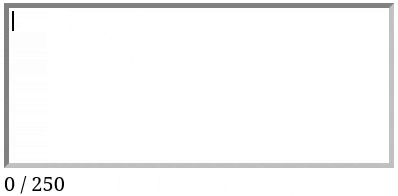

# Работа со стилями элементов

Чаще всего значения стилей элементов известны заранее. Даже если по ходу взаимодействия пользователя со страницей стили должны меняться, то обычно в JavaScript это можно реализовать путём [добавления или удаления классов элементов](./working_with_element_classes.md). Но если заранее описать все стили в CSS-файле всё же не представляется возможным, то JavaScript позволяет устанавливать стили конкретным элементам напрямую.

У объекта каждого элемента в свойстве `style` хранится объект `CSS2Properties`. Через этот объект можно получить текущие значения стилей элемента и установить новые.

```js
const div = document.querySelector("div");
div.style;         // Возвращает: объект CSS2Properties
div.style.height;  // Возвращает: ""
div.style.height = "50px";
div.style.width = "100px";
```

Установка стилей через объект `CSS2Properties` равносильна указанию стилей в атрибуте `style` в HTML. Такие стили относятся только к одному элементу и имеют более высокий приоритет, чем стили из CSS-файлов.

```html
<div style="height: 50px; width: 100px"></div>
```

Названия свойств в `CSS2Properties` пишутся так же, как принято писать названия переменных — слитно, с заглавной первой буквой в каждом слове кроме первого. Например, CSS-свойство `background-color` в объекте `CSS2Properties` называется `backgroundColor`.

Значения свойств должны быть строками и указываются в том же формате, что и в CSS-файлах. Например, в качестве значения можно указать размер в пикселях или процентах, цвет в виде `#`-кода или функции `rgb()` и так далее.

```js
div.style.borderWidth = "2px";
div.style.borderStyle = "solid";
div.style.borderColor = "#5E6B24"
div.style.backgroundColor = "rgb(222, 252, 95)";
```

## Упражнения

1. Реализуй страницу с прямоугольной формой, высоту и ширину которой пользователь задаёт сам через поля ввода.

1. На неком сайте бронирования отелей можно оставлять отзывы произвольной длины, но рекомендуемая длина — не менее 250 символов. Разработай поле ввода отзыва, которое при помощи цвета границы подсказывает, насколько длина отзыва близка к рекомендуемой. У пустого поля должна быть серая граница, у поля с 250 или более символами — зелёная, а по мере ввода текста цвет границы должен постепенно перетекать из серого в зелёный, проходя через множество оттенков. 

    
